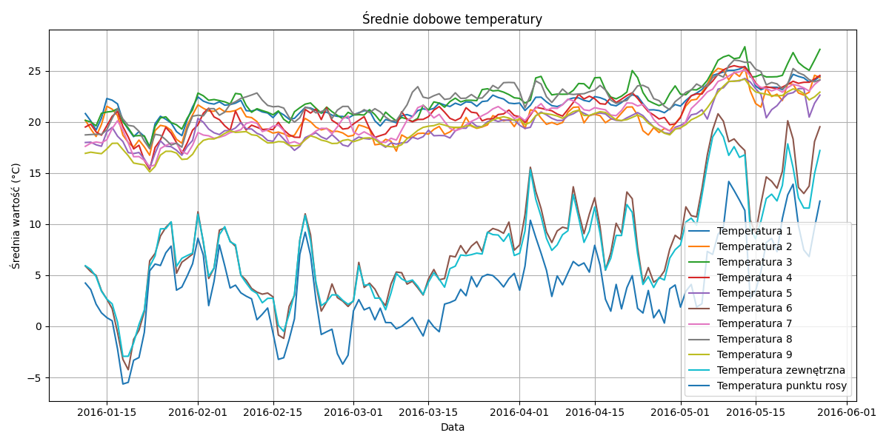
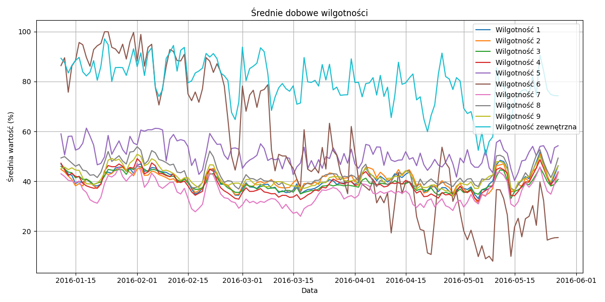
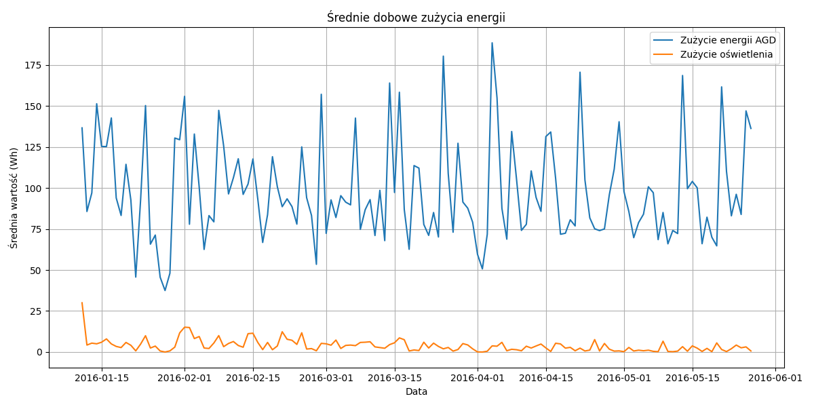
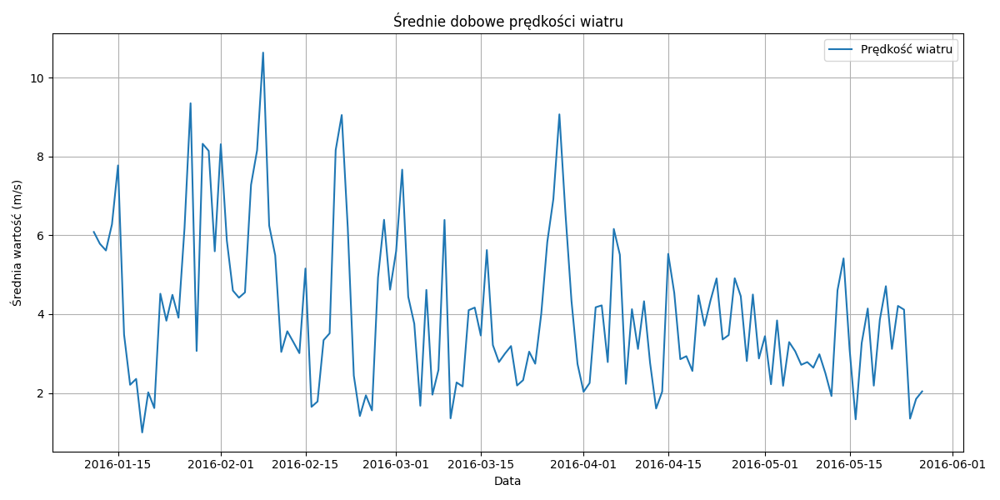
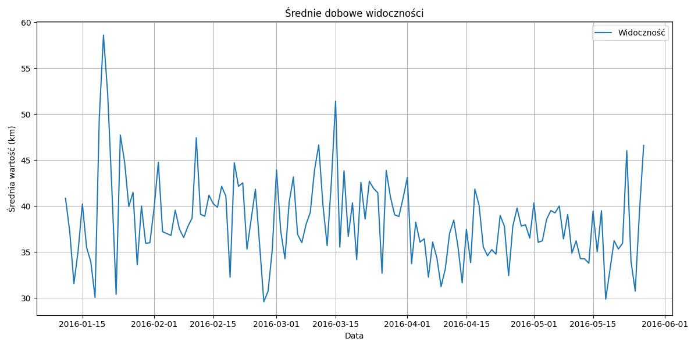
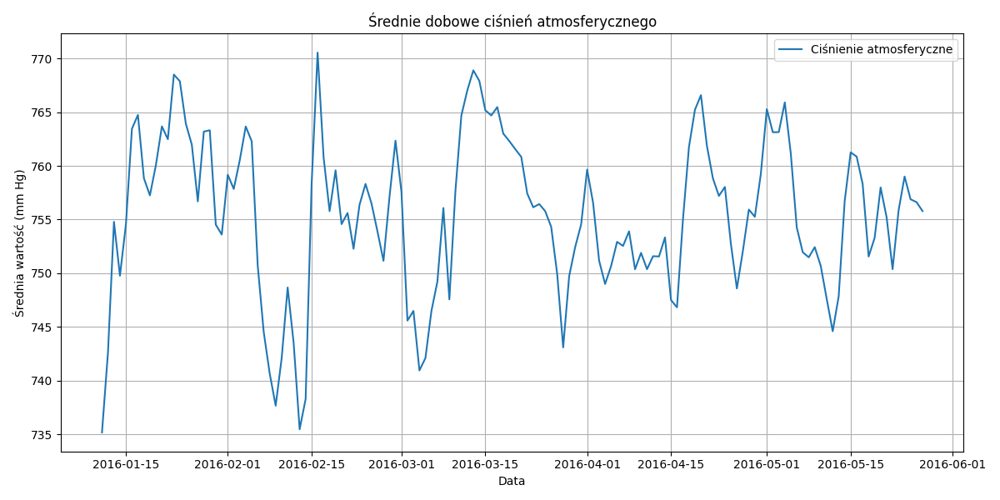
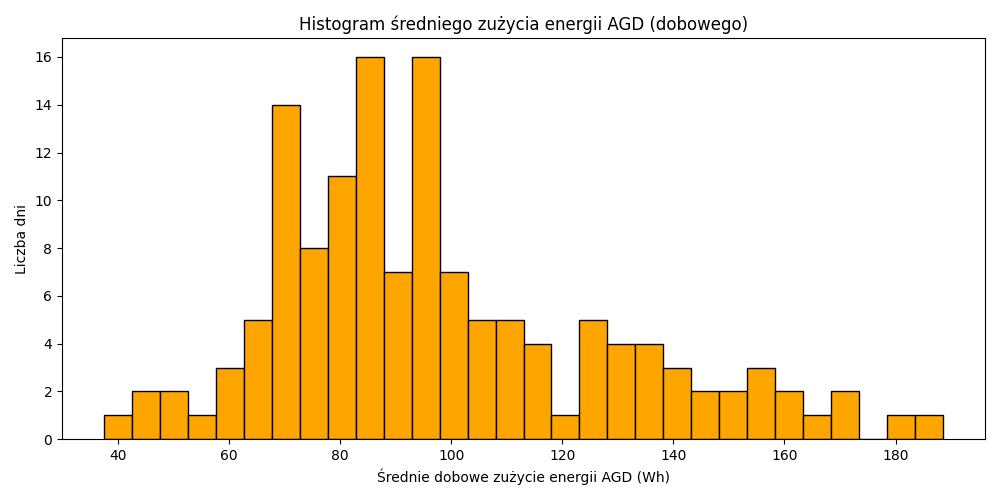
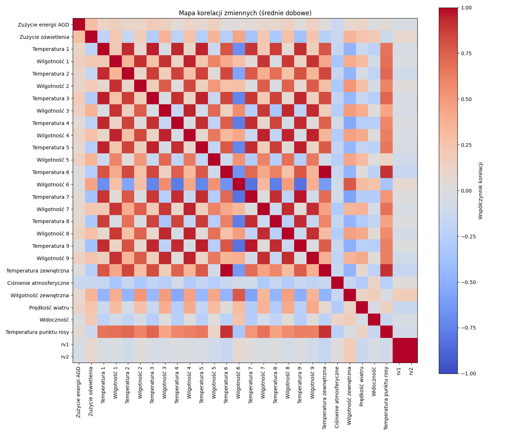

# Sprawozdanie: Moduł 2 - Zaawansowana analiza danych w systemie IoT
**Autor:** Jakub Bandura

## Cel zadania
Celem ćwiczenia było przygotowanie inżynierskiej analizy danych z systemu czujników IoT. Skrypt miał przetworzyć surowy zapis z pliku `energydata_complete.csv`, zidentyfikować sensowne miary oraz zwizualizować je w sposób ułatwiający interpretację i porównanie.

## Przetwarzanie danych
W skrypcie wykonano następujące operacje:
1. Wczytanie pliku CSV i konwersję kolumny `date` do formatu `datetime`.
2. Odfiltrowanie tylko kolumn numerycznych, aby skoncentrować analizę na pomiarach fizycznych i energetycznych.
3. Agregację do wartości dobowych za pomocą `resample('D').mean()`, co redukuje szum krótkookresowy i uwydatnia długoterminowe trendy.
4. Wyliczenie macierzy korelacji dla średnich dobowych, co pozwala ocenić powiązania między parametrami.
5. Zapis wygenerowanych danych do plików:
   - `daily_mean.csv`
   - `hourly_mean.csv`
   - `correlation_daily_mean.csv`

## Wykresy i ich znaczenie
Analiza została przedstawiona za pomocą oddzielnych wykresów dla każdej grupy zmiennych o tej samej jednostce. Taka organizacja jest inżyniersko uzasadniona, ponieważ porównywanie wartości o różnych jednostkach na jednym wykresie prowadzi do zniekształconych interpretacji.

### Wykresy agregacji dobowej według jednostek
Poniżej znajdują się wykresy pokazujące dobowe średnie w podziale na grupy o tej samej jednostce:

#### Temperatura

Na tym wykresie pokazano dobowe średnie temperatur z czujników wewnętrznych i zewnętrznych. Pozwala to porównać stabilność i sezonowe zmiany temperatur w różnych strefach domu.

#### Wilgotność

Wykres wilgotności pokazuje zmiany dobowych średnich wartości czujników wilgotności powietrza. Jest to istotne z punktu widzenia komfortu i efektywności systemów grzewczych oraz klimatyzacji.

#### Zużycie energii

Ten wykres obrazuje dobowe średnie zużycie energii przez urządzenia i oświetlenie. Umożliwia analizę trendów energetycznych oraz identyfikację okresów o zwiększonym zapotrzebowaniu.

#### Prędkość wiatru

Wykres przedstawia średnie dobowe prędkości wiatru z zewnętrznych pomiarów. Jest przydatny do oceny wpływu warunków pogodowych na instalację domową.

#### Widoczność

Widoczność mierzona w kilometrach obrazuje warunki atmosferyczne zewnętrzne i może być użyta do oceny jakości pomiarów oraz ich wpływu na zachowanie systemu.

#### Ciśnienie atmosferyczne

Wykres ciśnienia atmosferycznego pokazuje zmiany dobowe i jest ważny przy analizie powiązań pogodowych z zużyciem energii i temperaturą.

### Histogram zużycia energii AGD

Histogram obrazuje rozkład dobowego zużycia energii przez urządzenia AGD. Taki wykres jest przydatny do identyfikacji wartości typowych, odchyleń oraz dni, w których zużycie było nietypowo wysokie.

### Mapa korelacji

Mapa korelacji prezentuje powiązania między wszystkimi badanymi zmiennymi w formie macierzy. Dzięki polskim etykietom łatwiej wskazać silne zależności, np. między temperaturą zewnętrzną, wilgotnością i zużyciem energii.

## Uzasadnienie inżynierskie
Takie podejście jest typowe w analizie systemów IoT:
- agregacja dobowych średnich upraszcza wielkoskalową analizę i pozwala skupić się na istotnych trendach,
- grupowanie po jednostkach zapobiega błędnym wnioskom wynikającym z mieszania różnych skal,
- mapa korelacji umożliwia szybkie wykrycie zależności, które mogą być podstawą do dalszych modeli predykcyjnych,
- zapis wyników do plików `.csv` zachowuje dane w formacie gotowym na kolejne etapy analizy.

## Wnioski
Skrypt przenosi analizę z poziomu surowych logów do postaci czytelnych wykresów i zbiorów danych. Przetworzenie czasowe oraz podział na grupy jednostek daje praktyczne narzędzie do monitorowania zachowań systemu oraz do późniejszego wykorzystania w modelowaniu predykcyjnym lub optymalizacji zużycia energii.